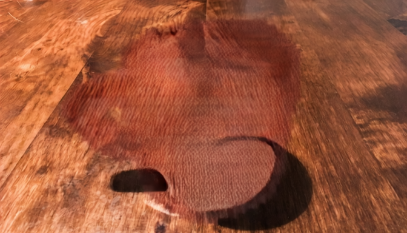
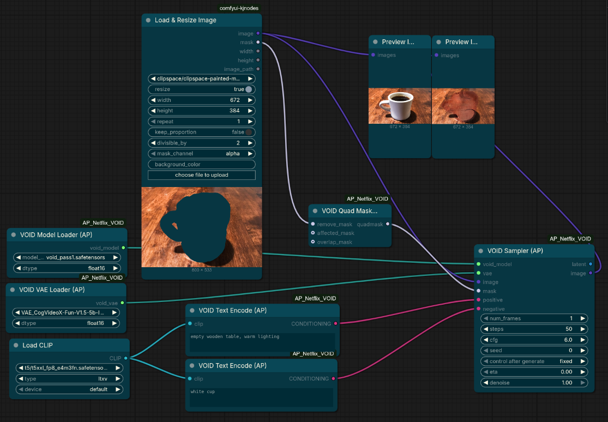

# AP Netflix VOID – ComfyUI Custom Nodes

Custom nodes for **VOID: Video Object and Interaction Deletion** by Netflix Research.
VOID removes objects from videos along with all physical interactions they cause (falling objects, displaced items, etc.), not just shadows and reflections.

Built on [CogVideoX-Fun-V1.5-5b-InP](https://huggingface.co/alibaba-pai/CogVideoX-Fun-V1.5-5b-InP) and fine-tuned with interaction-aware quadmask conditioning.

> Paper: [arxiv 2604.02296](https://arxiv.org/abs/2604.02296) · GitHub: [Netflix/void-model](https://github.com/netflix/void-model) · Model weights: Apache-2.0

---

## Example

| Input | Output |
|-------|--------|
|  |  |

*Coffee cup removed from a wooden table using Pass 1 at 672×384, 1 frame, 50 steps, CFG 6.0.*

---

## Downloads

| File | Source | Destination |
|------|--------|-------------|
| `void_pass1.safetensors` | [netflix/void-model](https://huggingface.co/netflix/void-model) | `ComfyUI/models/diffusion_models/` |
| `void_pass2.safetensors` *(optional)* | [netflix/void-model](https://huggingface.co/netflix/void-model) | `ComfyUI/models/diffusion_models/` |
| CogVideoX VAE (`diffusion_pytorch_model.safetensors`) | [alibaba-pai/CogVideoX-Fun-V1.5-5b-InP](https://huggingface.co/alibaba-pai/CogVideoX-Fun-V1.5-5b-InP) → `vae/` subfolder | `ComfyUI/models/vae/` |
| T5-XXL text encoder (e.g. `t5xxl_fp16.safetensors`) | ComfyUI model manager | `ComfyUI/models/clip/` |

**Pass 1 is sufficient for most videos.** Pass 2 adds optical-flow warped noise initialization for improved temporal consistency on longer clips.

The original `THUDM/CogVideoX-5b` VAE (`cogvideo5bvae.safetensors`) also works — it shares the same architecture and scaling factor (`0.7`).

---

## Installation

```bash
cd ComfyUI/custom_nodes
git clone https://github.com/your-username/AP_Netflix_VOID
```

No extra Python packages required beyond a standard ComfyUI installation.

---

## Nodes

### VOID Model Loader (AP)
Loads `void_pass1.safetensors` or `void_pass2.safetensors` → **VOID_MODEL**

| Input | Description |
|-------|-------------|
| `model_name` | Select from `models/diffusion_models/` |
| `dtype` | `bfloat16` (recommended) |

---

### VOID VAE Loader (AP)
Loads the CogVideoX 3D VAE → **VOID_VAE**

| Input | Description |
|-------|-------------|
| `vae_name` | Select from `models/vae/` |
| `dtype` | `bfloat16` (recommended) |

---

### VOID Text Encode (AP)
Encodes a text prompt with a T5-XXL CLIP model → **CONDITIONING**

Connect a `CLIPLoader` (T5-XXL) to the `clip` input.

> **Prompt tip:** Describe the scene **after** the object is removed — what the clean background looks like. Do **not** describe the object being removed.
> - ✅ `"wooden table, warm lighting"` (what should be there after removal)
> - ❌ `"A person being removed from the scene."`

---

### VOID Quad Mask (AP)
Converts separate mask layers into the 4-level quadmask VOID requires → **MASK**

A standard binary ComfyUI mask is also accepted and auto-converted (white = remove).

| Input | Type | Description |
|-------|------|-------------|
| `remove_mask` | MASK (required) | White = primary object to delete |
| `affected_mask` | MASK (optional) | White = region that physically reacts (e.g. object that falls when person is removed) |
| `overlap_mask` | MASK (optional) | White = pixels that are both primary and affected |

Quadmask pixel values:

| Value | Meaning |
|-------|---------|
| `0.0` (black) | Primary object — remove |
| `63/255` | Overlap of primary + affected |
| `127/255` | Affected region (physics interactions) |
| `1.0` (white) | Background — keep |

---

### VOID Sampler (AP)
Main inpainting node. Encodes image + quadmask, runs DDIM, decodes output.

| Input | Type | Description |
|-------|------|-------------|
| `void_model` | VOID_MODEL | From VOID Model Loader |
| `vae` | VOID_VAE | From VOID VAE Loader |
| `image` | IMAGE | Source frames — resize to **384×672** (H×W) for best results |
| `mask` | MASK | From VOID Quad Mask or any binary mask |
| `positive` | CONDITIONING | Background description after removal |
| `negative` | CONDITIONING | Negative prompt (quality artifacts, watermarks, etc.) |
| `num_frames` | INT | Frames to process. Use `4k+1` values: 1, 5, 9, 13, 17, 49, 97, 197 |
| `steps` | INT | DDIM steps — official default: **50** |
| `cfg` | FLOAT | CFG scale — recommended: **6.0** (matches official VOID pipeline) |
| `seed` | INT | RNG seed |
| `eta` | FLOAT | 0 = deterministic DDIM, 1 = DDPM stochastic |
| `denoise` | FLOAT | Official default: **1.0** (full noise from scratch) |

Outputs: **LATENT**, **IMAGE**

---

### VOID Latent → Image (AP)
Re-decodes a VOID LATENT using the 3D VAE without re-running the sampler.

---

## Recommended Workflow

A ready-to-use ComfyUI workflow is included: [`examples/03.04 Netflix VOID Test.json`](examples/03.04%20Netflix%20VOID%20Test.json)



```
[CLIPLoader T5-XXL] ──► [VOID Text Encode] ──► CONDITIONING (positive)
                                                                    │
[Load Image]        ──► IMAGE ─────────────────────────────────► [VOID Sampler] ──► IMAGE
[Load Mask]         ──► [VOID Quad Mask] ──► MASK ─────────────►
[VOID Model Loader] ──► VOID_MODEL ────────────────────────────►
[VOID VAE Loader]   ──► VOID_VAE ──────────────────────────────►
```

---

## Notes

- **Resolution:** 384×672 pixels (H×W) is the training resolution. Other sizes work but quality may degrade.
- **Frame count:** Must be `4k+1` for perfect VAE round-trip: 1, 5, 9, 13, 17, 49, 97, 197. Max: **197 frames**.
- **CFG:** Use `6.0` — the official VOID pipeline default. `1.0` disables CFG entirely and results in the model ignoring the positive prompt, producing poor removals.
- **Mask convention:** The `VoidQuadMask` node outputs black (0) = remove, white (1) = keep. Pass this directly to the sampler. Do **not** use `InvertMask` before it.
- **Text embeddings:** Prompts are internally padded to 226 tokens (the training sequence length). No padding node needed.
- **VAE scaling factor:** 0.7 (correct for both THUDM CogVideoX-5b and alibaba-pai CogVideoX-Fun-V1.5).
- **Text encoder:** Must be **T5-XXL** (4096-dim). CLIP L/G will produce silent conditioning.

---

## License

Custom node code: MIT — see [LICENSE](LICENSE)
VOID model weights: Apache-2.0 — see [netflix/void-model](https://huggingface.co/netflix/void-model)
